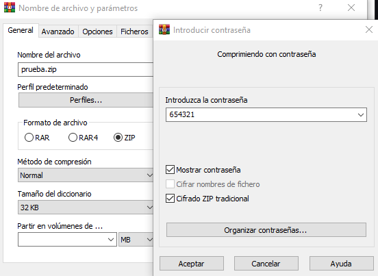

# python zip cracker

Este código es un script de Python que utiliza la librería pyzipper para extraer archivos ZIP protegidos con contraseña. El usuario puede ingresar un archivo ZIP y un archivo de diccionario que contiene una lista de posibles contraseñas. El script prueba cada contraseña del diccionario hasta encontrar la correcta, y luego extrae los archivos del archivo ZIP utilizando la contraseña encontrada. Si ninguna de las contraseñas del diccionario es correcta, el script imprime un mensaje de que no se encontró la contraseña.

## Requerimientos

- pyzipper

## Instalación

1. Clonar este repositorio:
```bash
git clone https://github.com/brianrscode/python-zip-cracker.git
```
2. Instalar los requerimientos:
```bash
pip install -r requirements.txt
```
## Uso
```bash
python zipCracker.py -f <archivo zip> -d <diccionario>
```

## Capturas del funcionamiento

<div align="center">
    
    <br>
    
</div>

## Licencia

Este proyecto se distribuye bajo la licencia MIT. Consulte el archivo LICENSE para obtener más detalles.
